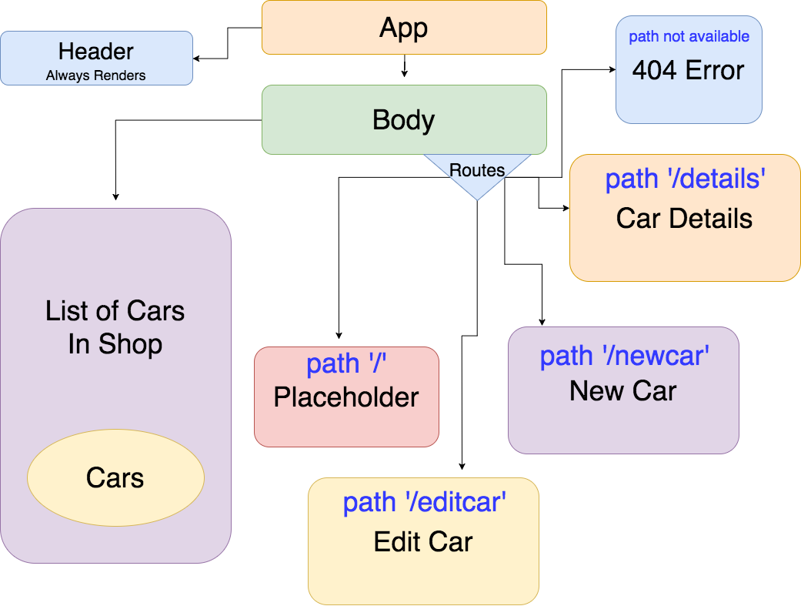

# Car-Tune Network

#### A vehicle inventory management system for automotive service departments _2018_

###### by **Adam Smith**

## Description

___Add a Notes section where you document unforeseen issues and questions you encountered during your development process. Commit these notes by themselves.
In your description of the project include your thoughts on the differences in development process in Angular versus React.___

This project is a re-imagining and refactor of an Angular project about managing animals in a zoo. This time we're managing vehicle inventory for an auto repair shop. The user has the ability to view and edit the details about cars that are in the shop at any given time including shop location (which bay the car is in), year, make, and model of car, reason for the car being in the shop, if the car has been inspected by a mechanic, and any progress that has been made.

The layout will be fairly straightforward: The App component will contain a Header and Body component. The Header and body will always be rendered. The Body will include a list of all cars currently in the shop. Another part of the Body will have Routes to view details about the car, edit details about or remove any car, or to add a new car.



## Notes

A lot of this process felt similar to building an Angular project. Building each piece as a component and routing them together brings back a lot of memories from the old days. The biggest difference so far is that I'm not sure how to pass data. Also the components in React feel a lot smaller than components in Angular. I do like that the React files have everything in one place: logic, styling, and markup. It makes a lot of sense to build that way so we aren't chasing down where each part is when we want to change something about a component. 

One of the biggest hurdles to overcome from the project today was passing the hard-coded data to different components for dynamic routing. In the lessons the data was hard-coded right into the component. Sure, that works ok, but it's limited to the file it is hard coded into. If you were to hard code it into any other files that needed the data, making changes to the data becomes more cumbersome and it isn't not very DRY. To solve the problem I had to put the data in a separate JavaScript (not JSX) file and import it into the components that need the data. Also, when generating a list of cars that would use the same detail component I passed the key into the URL like we did in Angular to use in dot-notation for accessing a particular subset of data in the array of cars in the inventory.

I chose not to link up Sass to this project, even after figuring out how to get it to reliably load with hot-module-replacement, because I found out that variables, or "CSS Custom Properties" as they are named, are totally in vanilla CSS. I'm not sure why I didn't know about that earlier, but it's incredibly straightforward and nullifies 95% of my reasoning for wanting to use Sass with my React project. My friend who is a React dev at Nike told me about another CSS library called Glamorous that builds CSS in JavaScript. His team is using it now because you can use it to style in both ReactJS and React Native.

## Setup

1. Open Terminal or Command Line.
2. Change directories to where you would like to clone the files.
3. Run
`$ git clone https://github.com/alspdx/car-tune-network.git`.
4. Change directories to the 'car-tune-network' directory.
5. Run the following in the command line:
```
$ npm install
$ npm run start
```
6. The project should be served at `http://localhost:8080/` or another location that will be shown in the Terminal window.

## Technologies Used:
* JavaScript
* React
* JSX
* Node.js
* NPM
* Webpack
* Babel

## License

Copyright (c) 2018, Adam Smith.

Permission is hereby granted, free of charge, to any person obtaining a copy of this software and associated documentation files (the "Software"), to deal in the Software without restriction, including without limitation the rights to use, copy, modify, merge, publish, distribute, sublicense, and/or sell copies of the Software, and to permit persons to whom the Software is furnished to do so, subject to the following conditions:

The above copyright notice and this permission notice shall be included in all copies or substantial portions of the Software.

THE SOFTWARE IS PROVIDED "AS IS", WITHOUT WARRANTY OF ANY KIND, EXPRESS OR IMPLIED, INCLUDING BUT NOT LIMITED TO THE WARRANTIES OF MERCHANTABILITY, FITNESS FOR A PARTICULAR PURPOSE AND NONINFRINGEMENT. IN NO EVENT SHALL THE AUTHORS OR COPYRIGHT HOLDERS BE LIABLE FOR ANY CLAIM, DAMAGES OR OTHER LIABILITY, WHETHER IN AN ACTION OF CONTRACT, TORT OR OTHERWISE, ARISING FROM, OUT OF OR IN CONNECTION WITH THE SOFTWARE OR THE USE OR OTHER DEALINGS IN THE SOFTWARE.
